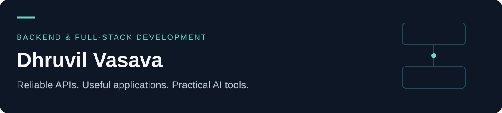

# Hi, I'm Dhruvil

I build backend services, full-stack applications, and practical AI tools with **TypeScript, JavaScript, and Python**. My projects explore how software handles real work: competing requests, background jobs, saved progress, and clear user interfaces.

I'm a **Senior Software Engineer and Team Lead at Avesta HQ**, with **4+ years of experience** delivering software for **view.com.au**. I lead a **7-engineer team** and work on APIs, marketplace workflows, and internal applications. The repositories below are independent portfolio projects; client source code is not published here.

Based in **Ahmedabad, India**. I'm interested in **backend and full-stack opportunities**.

[LinkedIn](https://www.linkedin.com/in/dhruvilvasava-a8a639218) · [Email me](mailto:dhruvilvasava1512@gmail.com)

## Start here

### [Auction Bidding Engine](https://github.com/Dhruvil151/auction-bidding-engine)
**Keeps an auction consistent when many people bid at once.**

Handles repeated requests and interrupted writes so retries can recover the original result. My strongest backend case study, with concurrency tests and documented local benchmarks.

`TypeScript` · `Fastify` · `RethinkDB` · `Docker`

[Explore the project](https://github.com/Dhruvil151/auction-bidding-engine#readme) · [See the engineering evidence](https://github.com/Dhruvil151/auction-bidding-engine/blob/main/docs/LOAD_RESULTS.md)

### [Support Ticket Dashboard](https://github.com/Dhruvil151/support-ticket-dashboard)
**Helps a team organize customer requests from open to resolved.**

A React interface backed by a validated Express API, with status filters, priority suggestions, and tests across the UI and backend. A local demo with in-memory storage.

`React` · `Express` · `JavaScript` · `OpenAPI`

[Explore the project](https://github.com/Dhruvil151/support-ticket-dashboard#readme)

### [AI Educational Video Generator](https://github.com/Dhruvil151/ai-video-generator)
**Turns a topic into an editable storyboard and narrated video.**

Connects AI scripting, background jobs, speech, and animation. Review the storyboard before rendering; generated lessons still need fact-checking and editorial review.

`Node.js` · `Remotion / React` · `Redis / BullMQ` · `Gemini`

[Explore the project](https://github.com/Dhruvil151/ai-video-generator#readme) · [Watch a narrated output](https://github.com/Dhruvil151/ai-video-generator/blob/main/docs/narrated-example.mp4)

## More things I've built

- **[LinkedIn Job Leads](https://github.com/Dhruvil151/linkedin-job-leads):** collects hiring posts and organizes them into a resume-matched shortlist, with saved progress and duplicate tracking. Python + SQLite.
- **[Barney Voice Assistant](https://github.com/Dhruvil151/barney-voice-assistant):** a character-inspired text and voice chat demo. Express + Groq + Python speech service.
- **[Zoro Orchestrator](https://github.com/Dhruvil151/zoro-orchestrator):** an experimental AI coding workflow that compares designs, plans tasks, and attempts implementation with test feedback. Node.js + Aider + Docker.

## What I work with

- **Backend:** Node.js, Express, Fastify, REST APIs, TypeScript, Python.
- **Frontend:** React, JavaScript, Vite.
- **Data and background work:** RethinkDB, SQLite, Redis, BullMQ.
- **Quality and tooling:** Vitest, Jest, Python unittest, Docker, GitHub Actions.

Each project starts with a plain-English explanation, followed by setup instructions and engineering details. Demo limitations and unverified integrations are documented alongside the code.

